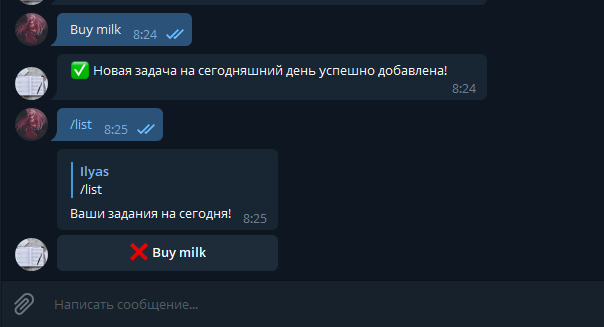

# DailyTasksBot

Welcome, it is DailyTasksBot

First, put your token to <b>settings.py</b>

### settings.py
<code>DB_FILENAME = 'data.db'</code> 
<code>TOKEN = "PUT YOUR TOKEN HERE"</code> 
### You can get the API TOKEN from <a href='t.me/botfather'>BotFather</a>

## Add your tasks by typing the message with the name of your task

## Type <code>/list</code> to see your tasks

## Press button to solve your problem

## Type <code>/settings</code> to set up the bot

You can enable/disable alerts and more

So, enjoy and colaborate 😉

### With ❤ <a href='t.me/WinDuz'>Ilyas Kalandar</a>
